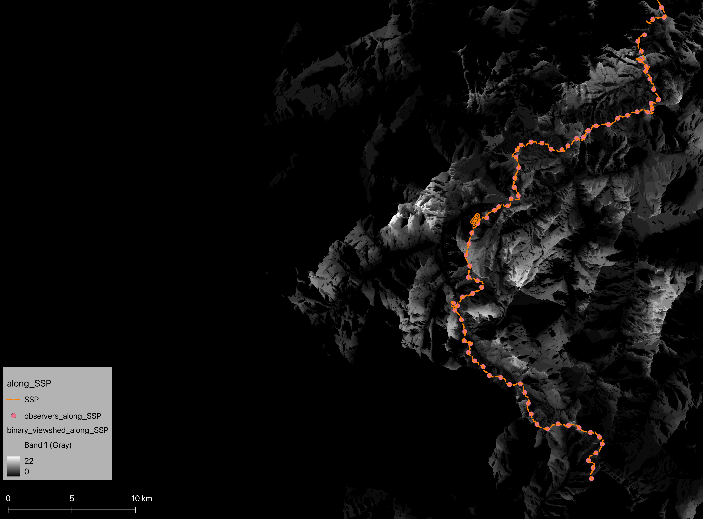

# Hiking in Appennino Tosco-Emiliano: Elevation & Intervisibility Analysis

This repository contains the code and data used to analyze the area surrounding Appennino Tosco-Emiliano National Park, focusing on elevation and intervisibility of mountain peaks and hiking trails within this region.

## Replicate results
The analysis can be replicated by:
1. Cloning this repository in the desired directory
``` 
git clone https://github.com/sraatgn/mountainpeaks-intervisibility.git
```
2. In that directory (`cd <dir/path>`), create a virtual environment:
``` 
python3.10 -m venv geoenv
```
3. Activate environment:
```
# On Windows
geoenv\Scripts\activate
# On macOS/Linux
source geoenv/bin/activate
```
4. Install required packages:
```
pip install -r requirements.txt
```
Large files (DEM and QGIS result layers) are not included, but can be retrieved by following the analysis workflow. 
The other data (geoJSON files) for Appennino Tosco-Emiliano is already available in the `data/` and `qgis_layers` directory. It can also be downloaded again by executing the code in the notebooks. 

## Contents
- `data/`: downloaded datasets.
- `qgis_analysis/`
    - `qgis_layers`: loaded layers for intervisibility analysis. 
	- `commands.txt`: commands to replicate analysis.
	- `visibility_analysis.qgz`: QGIS project.
- `scripts/`
	- `dem_and_peaks.ipynb`: notebook used for DEM and mountain peaks download, preprocessing and analysis.
	- `trail_analysis.ipynb`: notebook used for hiking trails and viewpoints download, preprocessing and analysis.
 - `report/`: analysis report.

## Example Results
An example of the result: network of visible peaks from Pietra di Bismantova


## Further Research
This analysis may be carried further by focusing on several aspects. For instance:
- Creating binary viewshed maps for entire trails (fig. below);
- Identify panoramic trails by combining intervisibility and viewshed performed along each trail;
- Identify potential unmarked viewpoints;
- Combine additional features (e.g. huts, water points, vegetation, parkings etc.).



### Note: analyze a different area
It is possible to analyze a different area by adjusting the bounding box used (`bbox_geom`) to download data for a different region. However, this is possible only for the DEM and mountain peaks analysis (`scripts/dem_and_peaks.ipynb` and QGIS), because the trail data used in `scripts/trail_analysis.ipynb` is available for the Emilia-Romagna region only. To perform the complete analysis by integrating the trails and viewpoint data for a different area of interest, an alternative trail data source may be used (adjust code accordingly). For instance, hiking trails for Trentino are available [here](https://www.sat.tn.it/sentieri/mappa-sentieri/). 

## Authors
- Sara Tegoni [@sraatgn](https://github.com/sraatgn)
